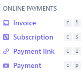
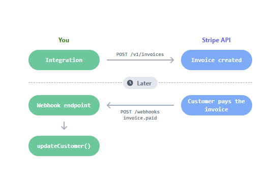

# Stripe

Opciones en stripe



En Stripe, tanto los pagos (payments) como las facturas (invoices) están relacionados con la facturación y el procesamiento de pagos, pero se utilizan en contextos diferentes y tienen propósitos distintos:

1. Payment (pago): Un payment en Stripe representa un pago procesado de forma individual. Es una transacción independiente que puede estar asociada a un cargo (charge) realizado por un cliente. Por ejemplo, cuando un cliente realiza un pago mediante tarjeta de crédito o una transferencia bancaria, se crea un payment correspondiente en Stripe. Los payments pueden ser realizados como cargos únicos o como parte de un plan de suscripción recurrente.

2. Invoice (factura): Una invoice en Stripe es un documento que detalla los cargos y los pagos relacionados con una o varias transacciones. Se utiliza para facturar a los clientes y proporcionarles un resumen de los importes adeudados y los pagos realizados. Las invoices suelen ser utilizadas en escenarios de facturación recurrente, como suscripciones mensuales o anuales. Se pueden generar automáticamente y enviar a los clientes por correo electrónico.

3. Suscripción (subscription): Una suscripción en Stripe es un acuerdo entre un cliente y un vendedor para el pago recurrente de bienes o servicios durante un período de tiempo determinado. Con una suscripción, se establece un plan de facturación periódico (mensual, anual, etc.) y se define el monto y la frecuencia de los pagos. Stripe se encarga de cobrar automáticamente a los clientes según lo especificado en la suscripción.

4. Enlace de pago (payment link): Un enlace de pago es una forma conveniente de solicitar pagos únicos a los clientes. Con un enlace de pago, puedes generar un enlace único y personalizado que puedes enviar a tus clientes por correo electrónico o compartir en otros canales. Los clientes pueden hacer clic en el enlace y realizar el pago utilizando diferentes métodos de pago admitidos por Stripe. Los enlaces de pago son ideales para pagos únicos, donaciones, compras rápidas y otros escenarios donde no se requiere una relación de facturación recurrente.

En resumen, una suscripción se utiliza para establecer pagos recurrentes a lo largo del tiempo, un enlace de pago se utiliza para solicitar pagos únicos y puntuales, y un pago representa una transacción individual, las invoices se utilizan para agrupar y facturar cargos recurrentes a los clientes. Las invoices proporcionan un mayor nivel de detalle y ofrecen un registro completo de los cargos y los pagos realizados a lo largo del tiempo.


# Integración/Implementación



# Ejemplo de pago con stripe


Instalamos la libería en caso de no ternerla en nuestro ambiente:

Importante stripe trabaja con monto en centavos!!!

Por ejemplo, si deseamos cargar $10.50 USD utilizando la API de Stripe, debemos especificar el monto como 1050 (10.50 * 100) al crear la transacción.


```python
import stripe
from django.conf import settings
from django.views.generic import TemplateView

stripe.api_key = settings.STRIPE_SECRET_KEY

class PaymentProcessView(TemplateView):
    template_name = 'payment_process.html'

    def post(self, request, *args, **kwargs):
        token = request.POST.get('stripeToken')

        try:
            charge = stripe.Charge.create(
                amount=29999,  # monto en centavos!!!
                currency='usd',
                source=token,
                description='Payment for Order #123'
            )
            # Aqui realizaremos acciones adicionales después de un pago exitoso, como crear una orden en tu base de datos, enviar un correo electrónico de confirmación, etc. Por ahora basta con encolar dichas actividades.

            return self.render_to_response({'success': True})

        except stripe.error.CardError as e:
            error_message = e.error.message
            return self.render_to_response({'error': error_message})

        except Exception as e:
            error_message = str(e)
            return self.render_to_response({'error': error_message})
```

En este ejemplo, se importa la biblioteca `stripe` y se establece la clave secreta de Stripe en `stripe.api_key` utilizando la configuración definida en `settings.STRIPE_SECRET_KEY`.

Dentro del método `post`, se obtiene el token de Stripe (`stripeToken`) del formulario enviado por el cliente. Luego, se crea un objeto de cargo (`Charge`) utilizando `stripe.Charge.create()` y se especifica el monto, la moneda, el token y la descripción del cargo.

En el bloque `try-except`, se capturan las excepciones específicas de Stripe (`stripe.error.CardError`) y cualquier otra excepción general que pueda ocurrir durante el proceso de pago. Dependiendo del resultado, se devuelve una respuesta al cliente, mostrando un mensaje de éxito o un mensaje de error en la plantilla `payment_process.html`.

Para utilizar Stripe en Django, debemos  haber configurado las claves de API de Stripe (`STRIPE_SECRET_KEY` y `STRIPE_PUBLISHABLE_KEY`) en el archivo `settings.py` del proyecto. 

